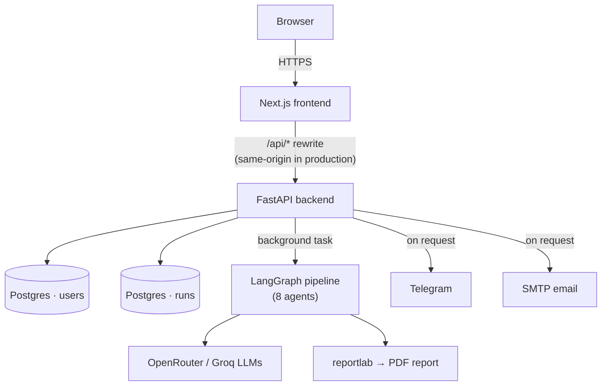
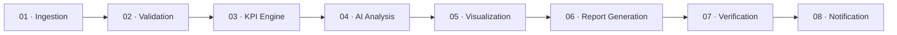

<div align="center">

# Fibrion AI

**Verified production intelligence for weaving manufacturers.**

Upload a production dataset → get KPIs, anomaly detection, an AI-written analysis, and a management-ready PDF report — with every numerical claim checked against the source data before it's ever delivered.

[](https://github.com/imusmanjd/Fibrion-AI/actions/workflows/ci.yml)


[](LICENSE)

</div>

---

## Why this exists

LLMs are good at language, not arithmetic — ask one to summarize a spreadsheet and it will happily generate a confident, wrong number. That's a real problem in a manufacturing report someone's going to act on.

Fibrion doesn't let the model do the math. Every KPI is computed deterministically with pandas *before* the LLM ever sees the data, and a dedicated verification agent checks the AI-written narrative's claims back against those numbers before a report goes out. The model's job is to explain what the numbers mean — not to invent them.

## What it does

1. **Upload** a weaving production dataset (`.csv`, `.xlsx`, `.xls`)
2. **Ingestion** reads and normalizes it — handles messy real-world column names, supplementary orders, and non-order rows automatically
3. **Validation** checks data quality before anything downstream trusts it
4. **KPI Engine** computes fulfillment %, rejection %, and shrink variance per order and overall
5. **Anomaly Detection** flags statistical outliers (z-score based) across orders
6. **AI Analysis** drafts an executive summary, key findings, likely causes, and recommendations
7. **Visualization** generates the supporting charts
8. **Report Generation** assembles a management-ready PDF
9. **Verification** re-checks every numerical claim in the AI narrative against the actual computed KPIs — a run only completes once this passes
10. **Notification** delivers the report by email or Telegram, on request

## Architecture



**Deployment note:** frontend and backend ship as a single Render Web Service — one container runs Next.js on the public port and FastAPI internally on `:8000`, with Next.js's own rewrite proxying `/api/*` to it. The browser only ever talks to one origin.

### The pipeline



## Features

| | |
|---|---|
| 📤 **Dataset upload** | `.csv` / `.xlsx` / `.xls`, validated before processing |
| 📊 **Deterministic KPIs** | Fulfillment, rejection, shrink variance — pandas, not the LLM |
| 🚨 **Anomaly detection** | Z-score outlier flagging per order, with severity |
| 🧠 **AI analysis** | Executive summary, findings, likely causes, recommendations |
| 🛡️ **Verification** | AI-written numerical claims checked against real KPI values before release |
| 📄 **PDF reports** | Generated with `reportlab`, downloadable or sent directly |
| 📧📱 **Delivery** | Email or Telegram, triggered independently after a run completes |
| 🔐 **Accounts** | Email/password auth, JWT in an httpOnly cookie |
| 💾 **Persistence** | Every run is saved to Postgres, scoped to its owner — survives restarts, queryable history |
| ✅ **Tested** | 46 backend tests (pytest) + lint (ruff), enforced in CI on every push |

## Tech stack

| Layer | Stack |
|---|---|
| Frontend | Next.js 15, React, TypeScript |
| Backend | FastAPI, Python 3.12 |
| Agentic pipeline | LangGraph |
| Data processing | pandas, NumPy |
| Database | PostgreSQL via SQLAlchemy + Alembic migrations |
| Auth | Passlib (bcrypt) + python-jose (JWT), httpOnly cookie session |
| PDF generation | ReportLab |
| Charts | Matplotlib |
| LLM providers | OpenRouter, Groq (provider-agnostic client) |
| Delivery | Telegram Bot API, SMTP |
| Testing | pytest, ruff |
| CI | GitHub Actions |
| Deployment | Docker, single-service Render deployment |

## Getting started

### Prerequisites
- Python 3.12
- Node.js 18+
- A Postgres database (a free [Neon](https://neon.tech) instance works well) — or leave `DATABASE_URL` unset and it falls back to a local SQLite file for quick local dev

### 1. Clone

```bash
git clone https://github.com/imusmanjd/Fibrion-AI.git
cd Fibrion-AI
```

### 2. Backend

```bash
cd backend
python -m venv .venv
.venv\Scripts\activate        # Windows
# source .venv/bin/activate   # macOS/Linux

pip install -r requirements.txt
cp .env.example .env          # fill in your keys — see below
alembic upgrade head          # creates the users/runs tables
uvicorn main:app --reload
```
Backend runs at `http://127.0.0.1:8000`.

### 3. Frontend

```bash
cd frontend
npm install
npm run dev
```
Frontend runs at `http://localhost:3000` and talks to the backend directly in dev (no proxy needed locally).

### 4. Try it

Open `http://localhost:3000`, create an account, and upload a weaving production dataset. A sample dataset is available — see [Dataset](#dataset) below.

## Environment variables

Set these in `backend/.env` (see `backend/.env.example` for the template):

<details>
<summary><strong>Click to expand full list</strong></summary>

| Variable | Required | Notes |
|---|---|---|
| `OPENROUTER_API_KEY` | ✅ | LLM provider |
| `TELEGRAM_BOT_TOKEN` | ✅ | Required even if you don't use Telegram delivery |
| `JWT_SECRET_KEY` | ✅ | Any long random string — generate with `python -c "import secrets; print(secrets.token_urlsafe(32))"` |
| `DATABASE_URL` | – | Postgres connection string. Falls back to a local SQLite file if unset |
| `GROQ_API_KEY` | – | Optional second LLM provider |
| `DEFAULT_MODEL_FAST` / `DEFAULT_MODEL_REASONING` | – | Model IDs, sensible defaults provided |
| `SMTP_HOST` / `SMTP_PORT` / `EMAIL_ADDRESS` / `EMAIL_APP_PASSWORD` | – | Only needed for email delivery |
| `FIBRION_ENV` | – | `development` (default) or `production` — controls cookie `Secure` flag |
| `LOG_LEVEL` | – | Defaults to `INFO` |

</details>

Frontend: `NEXT_PUBLIC_API_URL` (optional) — defaults to `/api` in production (see the deployment note above) or `http://127.0.0.1:8000` in local dev.

## Testing & CI

```bash
cd backend
ruff check .
pytest -q
```
46 tests covering KPI math, anomaly detection, file parsing, the full auth flow (register/login/logout/ownership isolation), and run persistence — all running against a real, isolated in-memory database per test, no mocking of the actual logic. Both checks run in GitHub Actions on every push and PR to `main`.

## Project structure

Fibrion-AI/
├── backend/
│ ├── agents/ # the 8 pipeline agents
│ ├── api/ # upload, runs, auth routes
│ ├── core/ # config, database, models, schema_registry
│ ├── orchestration/ # LangGraph wiring
│ ├── services/ # run_store, auth_service, file_parser, email/telegram
│ ├── bot/ # standalone Telegram bot
│ ├── alembic/ # DB migrations
│ ├── tests/
│ └── main.py
├── frontend/
│ ├── app/ # Next.js App Router pages
│ ├── components/
│ └── lib/ # API client, auth context, types
├── Dockerfile # single-container deploy (see Architecture)
├── start.sh
└── .github/workflows/ci.yml


## Dataset

Fibrion was built and validated against the **`full_weaving_dataset`** (121,148 rows × 18 columns) published on Mendeley Data:

> Ahmed, T. (2023). *full_weaving_dataset*. Mendeley Data, V1. [https://doi.org/10.17632/nxb4shgs9h.1](https://doi.org/10.17632/nxb4shgs9h.1)
> Accompanying paper: Ahmed & Uddin, *"Textile weaving dataset for machine learning to predict rejection and production of a weaving factory,"* Data in Brief, 2023. [https://doi.org/10.1016/j.dib.2023.108995](https://doi.org/10.1016/j.dib.2023.108995)
> Collected at the National Institute of Textile Engineering and Research (NITER) / Evince Textiles Ltd., Bangladesh.

Working with a real production dataset (not synthetic data) is what surfaced the edge cases Fibrion actually handles: supplementary orders, non-order material rows, and undefined-metric division-by-zero cases that need to degrade to `null` rather than crash the API.

## Roadmap

**Done**
- [x] Core 8-agent LangGraph pipeline
- [x] Deterministic KPI computation + z-score anomaly detection
- [x] Verification-gated AI analysis
- [x] PDF report generation
- [x] Email + Telegram delivery
- [x] Auth (JWT / httpOnly cookie)
- [x] Postgres persistence (users + runs, Alembic-migrated)
- [x] Test suite + CI

**Next**
- [ ] Additional process modules (spinning, dyeing & finishing, garment) — only Weaving is registered today
- [ ] Dataset Q&A (ask questions about a completed run)
- [ ] Rate limiting
- [ ] Role-based access for team accounts

## Contributing

```bash
git checkout -b feature/my-feature
# make changes
git commit -m "feat: add my feature"
git push origin feature/my-feature
```
Then open a PR. `ruff check .` and `pytest -q` must both pass — CI will check.

## License

[MIT](LICENSE) © 2026 Usman Javaid

## Author

**Usman Javaid** — Textile Engineering × AI. Built around the idea that domain expertise plus solid engineering beats a chatbot wrapper: analyze, verify, report, deliver.